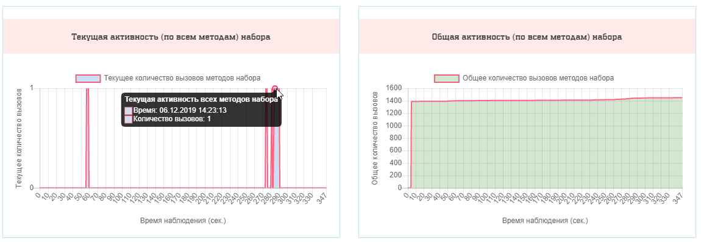
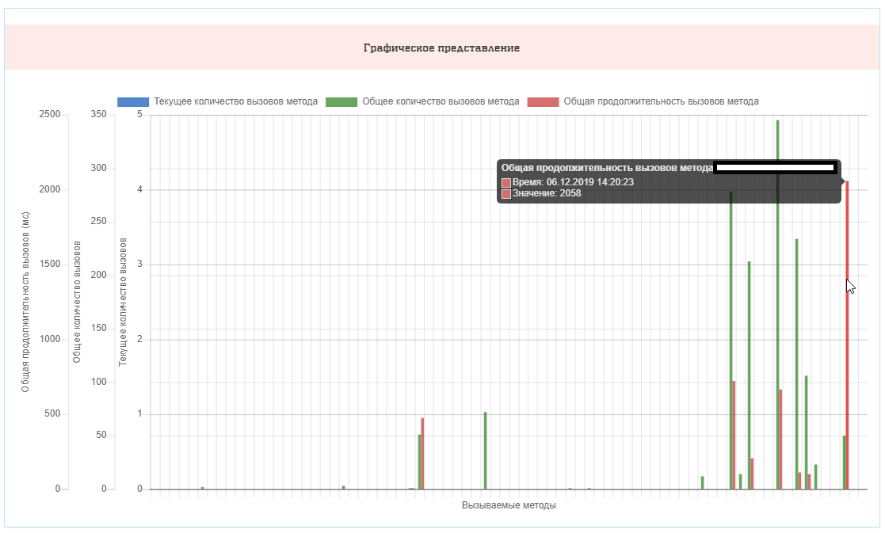
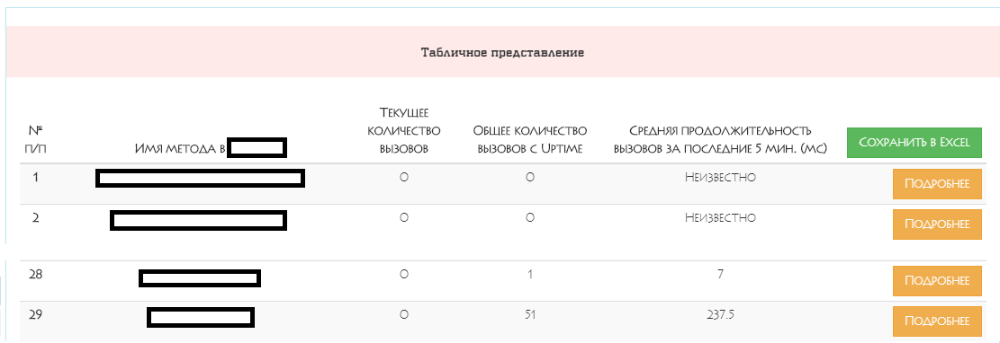

#


----------

[Документация на Английском](README.md) | [Документация на Русском](README_RU.md)


----------


**Unchase Fluent Performance Meter** это кросс-платформенная open-source *.Net Standard 2.0* библиотека, предназначенная для подсчёта производительности выполнения методов.

Библиотека может быть использована в .NET Core и .NET Framework приложениях, поддерживающих *.Net Standard 2.0*, и позволяет:

* [**Производить точные замеры**](#SimpleSamples) производительности ***public* методов** для ***public* классов** как вашего кода, так и [кода используемых библиотек](#SampleExternal) (с фиксацией точного времени начала и окончания выполнения замера);

* [**Добавлять к результатам**](#SampleCustomData) замеров **дополнительные данные** (Custom Data). Например, значения входных параметров метода и полученный результат; или данные контекста выполнения метода; или *corellationId*, по которому можно будет связать несколько замеров производительности методов;

* [**Разбивать замер**](#SampleCustomData) производительности метода **на отдельные шаги** (Steps) с фиксацией собственных данных для каждого шага. Кроме того можно [задать минимальное время](#SampleIgnore) выполнения, начиная с которого шаг будет учитываться в замере (если шаг выполнится быстрее, то не попадёт в замер);

* [**Исключать из замера**](#SampleIgnore) производительности **отдельные части кода** (например, вызовы отдельных методов, время исполнения которых не нужно учитывать при замере);

* [**Добавлять собственные команды**](#SampleCustomCommands) (Commands), которые гарантированно **будут исполнены сразу после** окончания замера производительности метода (например, для добавления дополнительной обработки полученных результатов, таких как логирование или запись данных в хранилище);

* [**Добавлять свой обработчик исключений**](#SampleCustomExceptionHandler) для кода, выполняемого в контексте замера производительности метода (как общий для всех замеров, так и для каждого замера в отдельности);

* [**Устанавливать время хранения результатов**](#SampleSettingCacheTime) замеров производительности методов, по истечении которого результаты будут удалены;

* [**Добавить в результаты замера**](#SampleSetCallerAndSourceWithStop) данные о том, **кто вызывает метод** (Caller) через *IHttpContextAccesor* или задание Caller'а в коде (например, можно указать название внешнего сервиса, который вызвал метод);

* [**Добавить в результаты замера**](#SampleSetCallerAndSourceWithStop) данные о месте запуска замера производительности (название файла и номер строки с местом вызова в коде);

* [**Прервать замер**](#SampleSetCallerAndSourceWithStop) производительности метода **до окончания его выполнения**.

Полученные в результате замеров производительности методов данные можно использовать для анализа производительности приложения (отдельных его частей, как внутренних - собственный код, так и внешних - код используемых библиотек) и вывести в удобном для вас графическом виде. Например, в таком:








> Проект разработан и поддерживается [Чеботовым Николаем (**Unchase**)](https://github.com/unchase).

## Builds status

|Status|Value|
|:----|:---:|
|Build|[](https://ci.appveyor.com/project/unchase/unchase.fluentperformancemeter)
|Buid History|
|GitHub Release|[](https://github.com/unchase/Unchase.fluentperformancemeter/releases/latest)
|GitHub Release Date|[](https://github.com/unchase/Unchase.fluentperformancemeter/releases/latest)
|GitHub Release Downloads|[](https://github.com/unchase/Unchase.fluentperformancemeter/releases/latest)
|Nuget Version|[](https://www.nuget.org/packages/Unchase.fluentperformancemeter/) 
|Nuget Downloads|[](https://www.nuget.org/packages/Unchase.fluentperformancemeter/)
|Nuget Version (AspNetCore.MVC)|[](https://www.nuget.org/packages/Unchase.fluentperformancemeter.aspnetcore.mvc/) 
|Nuget Downloads (AspNetCore.MVC)|[](https://www.nuget.org/packages/Unchase.fluentperformancemeter.aspnetcore.mvc/)

## Содержание

* [Начало работы](#Start)
* [Примеры использования](#SimpleSamples)
	* [Измерение производительности метода](#SimpleSamples)
	* [Измерение производительности метода с помощью `DiagnosticSource`](#DiagnosticSourceSample)
    * [Измерение производительности метода с помощью атрибута `WatchingPerformanceAttribute`](#WatchingPerformanceSample)
	* [Измерение производительности метода используемой библиотеки](#SampleExternal)
	* [Добавление дополнительных данных (Custom Data) и разбиение на шаги (Steps)](#SampleCustomData)
	* [Исключение из замера (Ignore)](#SampleIgnore)
	* [Добавление команд (Commands) и действий (Actions)](#SampleCustomCommands)
	* [Добавление обработчиков исключений (Exception Handlers)](#SampleCustomExceptionHandler)
	* [Установка времени хранения данных (Set Cache Time)](#SampleSettingCacheTime)
	* [Добавление данных о вызывающем метод и месте вызова (прерывание замера производительности)](#SampleSetCallerAndSourceWithStop)

## <a name="Start"></a> Начало работы

Для использования библиотеки установите [*NuGet* пакет](https://www.nuget.org/packages/Unchase.FluentPerformanceMeter/) в ваш проект:

#### Вручную с помощью менеджера *NuGet* пакетов (Package Manager):

```powershell
Install-Package Unchase.FluentPerformanceMeter
```

#### С помощью .NET CLI:

```powershell
dotnet add package Unchase.FluentPerformanceMeter --version {version}
```

> Где {version} - это версия пакета, которую вы хотите установить. 
> Например, `dotnet add package Unchase.FluentPerformanceMeter --version 1.0.0`

## <a name="SimpleSamples"></a> Примеры использования 

### Измерение производительности метода

Далее приведён простейший пример использования библиотеки (без конфигурирования и дополнительных настроек) для замера производительности метода (Action) `SimpleWatchingMethodStart` контроллера (Controller) `PerformanceMeterController` *Asp.Net Core 2.2 WebAPI* приложения. Для это можно использовать метод расширения `.WatchingMethod().Start()` или аналогичный по функциональности `.StartWatching()`. 
С версии v1.0.5 также можно использовать `.WatchingMethod().Start(SimpleWatchingMethodStart)` или `.StartWatching(SimpleWatchingMethodStart)` с указанием имени метода. 

> Все примеры использования библиотеки можно найти в проектах `Unchase.FluentPerformanceMeter.Test*` данного репозитория.

```csharp
/// <summary>
/// Test GET method with simple performance watching.
/// </summary>
[HttpGet("SimpleWatchingMethodStart")]
public ActionResult SimpleWatchingMethodStart()
{	
    // for C# 8 you can use:
    //using var pm = PerformanceMeter<PerformanceMeterController>.StartWatching();

    using (PerformanceMeter<PerformanceMeterController>.WatchingMethod().Start())
    {
        // put your code with some logic here

        return Ok();
    }
}
```

Для получения результатов замеров производительности публичных методов класса-контроллера `PerformanceMeterController` можно вызвать следующий метод:

```csharp
/// <summary>
/// Get methods performance info for this controller.
/// </summary>
/// <returns>Returns methods performance info.</returns>
[HttpGet("GetPerformanceInfo")]
[IgnoreMethodPerformance]
public ActionResult<IPerformanceInfo> GetPerformanceInfo()
{
    return Ok(PerformanceMeter<PerformanceMeterController>.PerformanceInfo);
}
```

После вызова метода `SimpleWatchingMethodStart` при вызове `GetPerformanceInfo` получим:

```json
{
  "methodCalls": [
    {
      "methodName": "SimpleWatchingMethodStart",
      "elapsed": "00:00:00.0016350",
      "caller": "unknown",
      "startTime": "2019-12-06T10:27:27.3385385Z",
      "endTime": "2019-12-06T10:27:27.3401735Z",
      "customData": {},
      "steps": []
    }
  ],
  "totalActivity": [
    {
      "methodName": "SimpleWatchingMethodStart",
      "callsCount": 1
    }
  ],
  "currentActivity": [
    {
      "methodName": "SimpleWatchingMethodStart",
      "callsCount": 0
    }
  ],
  "uptimeSince": "2019-12-06T10:27:27.3370183Z",
  "className": "Unchase.FluentPerformanceMeter.TestWebAPI.Controllers.PerformanceMeterController",
  "methodNames": [
    "SimpleWatchingMethodStart"
  ],
  "customData": {},
  "timerFrequency": 10000000
}
```

### <a name="DiagnosticSourceSample"></a> Измерение производительности метода с помощью `DiagnosticSource`

Начиная с версии *v1.1.0* появилась возможность мерять производительность методов в *AspNetCore MVC* приложении с помощью `DiagnosticSource` и специального атрибута `WatchingWithDiagnosticSourceAttribute`.
Для этого необходимо добавить в проект *NuGet* пакет [`Unchase.FluentPerformanceMeter.AspNetCore.Mvc`](https://www.nuget.org/Unchase.FluentPerformanceMeter.AspNetCore.Mvc), и добавить в `Startap.cs` следующий код:

```csharp
public void ConfigureServices(IServiceCollection services)
{
    // ...
    
    // allows to measure methods performance for class "MeasurableClass" and "MeasurableSecondClass"
    services.AddPerformanceDiagnosticObserver<MeasurableClass>();
    services.AddPerformanceDiagnosticObserver<MeasurableSecondClass>();
    // ... the same for another classes

    services.AddMvc();

    // ...
}

public void Configure(IApplicationBuilder app, IHostingEnvironment env)
{
    // ...

    app.UsePerformanceDiagnosticObserver();

    app.UseMvc();
}
```

После чего пометить атрибутом `WatchingWithDiagnosticSourceAttribute` либо отдельные методы:

```csharp
[HttpGet("SimpleWatchingMethodStart")]
[WatchingWithDiagnosticSource]
public ActionResult SimpleWatchingMethodStart()
{	
    return Ok();
}
```

либо весь класс:

```csharp
[ApiController]
[Route("api/v1/[controller]")]
[Produces("application/json")]
[SwaggerTag("Unchase.PerformanceMeter Test WebAPI Controller")]
[WatchingWithDiagnosticSource]
public class PerformanceMeterController : ControllerBase
{
    // measurable methods
}
```

Начиная с версии *v1.2.0* появилась возможность добавлять аргументы вызова к пользовательским данным замера производительности методов в *AspNetCore MVC* приложении с помощью специального атрибута `AddMethodArgumentsToCustomDataAttribute` в связке с атрибутом `WatchingWithDiagnosticSourceAttribute`:

```csharp
[HttpPost("SimpleWatchingMethodStartWithArgs")]
[WatchingWithDiagnosticSource]
[AddMethodArgumentsToCustomData("actionArguments")]
public ActionResult SimpleWatchingMethodStartWithArgs(DTOArgument arg)
{
    return Ok();
}
```

После вызова метода `SimpleWatchingMethodStartWithArgs` при вызове `GetPerformanceInfo` получим:

```json
{
  "methodCalls": [
    {
      "methodName": "SimpleWatchingMethodStartWithArgs",
      "elapsed": "00:00:00.0016350",
      "caller": "unknown",
      "startTime": "2019-12-06T10:27:27.3385385Z",
      "endTime": "2019-12-06T10:27:27.3401735Z",
      "customData": {
        "actionArguments": {
          "arg": {
            "data": "<string_in_DTOArgument>"
          }
        }
      },
      "steps": []
    }
  ],
  "totalActivity": [
    {
      "methodName": "SimpleWatchingMethodStartWithArgs",
      "callsCount": 1
    }
  ],
  "currentActivity": [
    {
      "methodName": "SimpleWatchingMethodStartWithArgs",
      "callsCount": 0
    }
  ],
  "uptimeSince": "2019-12-06T10:27:27.3370183Z",
  "className": "Unchase.FluentPerformanceMeter.TestWebAPI.Controllers.PerformanceMeterController",
  "methodNames": [
    "SimpleWatchingMethodStartWithArgs"
  ],
  "customData": {},
  "timerFrequency": 10000000
}
```

### <a name="WatchingPerformanceSample"></a> Измерение производительности метода с помощью атрибута `WatchingPerformanceAttribute`

Начиная с версии [*v2.0.0*](https://github.com/unchase/Unchase.FluentPerformanceMeter/releases/tag/v2.0.0) появилась возможность мерять производительность методов в *AspNetCore MVC* приложении с помощью специального атрибута `WatchingPerformanceAttribute`, а также конфигурировать сбор производительности методов контроллера в `Startup.cs`.
Для этого необходимо добавить в проект *NuGet* пакет [`Unchase.FluentPerformanceMeter.AspNetCore.Mvc`](https://www.nuget.org/Unchase.FluentPerformanceMeter.AspNetCore.Mvc), и добавить в `Startap.cs` следующий код:

```csharp
public void ConfigureServices(IServiceCollection services)
{
    // ...
    
    // allows to measure methods performance for class "MeasurableController" with configuring options
    services.AddPerformanceMeter<MeasurableController>(options => 
    {
        // ALL of this is optional. You can simply call .AddPerformanceMeter<MeasurableController>() for all defaults
        // Defaults: In-Memory for 5 minutes, everything watched, every user can see

        // excludes a method from performance watching
        options.ExcludeMethod(nameof(PerformanceMeterController.SimpleWatchingMethodStartWatchingPerformanceAttribute));

        // to control which requests are watched, use the Func<HttpRequest, bool> option:
        options.ShouldWatching = request => request.HttpContext.User.IsInRole("Dev");

        // allows to add custom data from custom attributes ("MethodCustomDataAttribute", "MethodCallerAttribute") to performance watching
        options.AddCustomDataFromCustomAttributes = false;

        // allows to use "IgnoreMethodPerformanceAttribute" for excluding from performance watching
        options.UseIgnoreMethodPerformanceAttribute = false;

        // allows to watch actions performance annotated with special attribute ("WatchingPerformanceAttribute")
        options.WatchForAnnotatedWithAttributeOnly = false;

        // excludes a path from being watched
        options.IgnorePath("/some_path");

        // allows to add route path to custom data (with "pm_path" key)
        options.AddRoutePathToCustomData = false;

        // set cache time for the watched performance results for the controller class
        options.SetMethodCallsCacheTime(5);

        // adds common custom data (anonymous class) to class performance information
        options.AddCustomData("Custom anonymous class", new { Name = "Custom Name", Value = 1 });

        // set default exception handler for the controller class
        options.SetDefaultExceptionHandler((ex) => Debug.WriteLine(ex.Message));
    });
    // ... and for "MeasurableSecondController" (without configuring options)
    services.AddPerformanceMeter<MeasurableSecondController>();
    // ... the same for another controllers

    services.AddMvc();

    // ...
}

public void Configure(IApplicationBuilder app, IHostingEnvironment env)
{
    // ...

    app.UseRouting();

    app.UseEndpoints(c =>
    {
        c.MapControllers();

        // use performance watching for concrete controller (for example, "MeasurableController")
        app.UsePerformanceMeterFor<MeasurableController>();
        // ... the same for another controllers
    });
}
```

После чего пометить атрибутом `WatchingPerformanceAttribute` либо отдельные методы:

```csharp
[HttpGet("SimpleWatchingMethodStartWatchingPerformanceAttribute")]
[WatchingPerformance]
public ActionResult SimpleWatchingMethodStartWatchingPerformanceAttribute()
{	
    return Ok();
}
```

либо весь класс:

```csharp
[ApiController]
[Route("api/v1/[controller]")]
[Produces("application/json")]
[SwaggerTag("Unchase.PerformanceMeter Test WebAPI Controller")]
[WatchingPerformance]
public class PerformanceMeterController : ControllerBase
{
    // measurable methods (actions)
}
```

### <a name="SampleExternal"></a> Измерение производительности метода используемой библиотеки

Чтобы замерить производительность *public* метода *public* класса сторонней используемой библиотеки, необходимо явно задать сам класс и имя его метода:

```csharp
[HttpGet("GetThreadSleepPerformance")]
public ActionResult<string> GetThreadSleepPerformance()
{
    using (PerformanceMeter<Thread>.WatchingMethod(nameof(Thread.Sleep)).Start())
    {
        Thread.Sleep(1000);
    }

    return Ok(PerformanceMeter<Thread>.PerformanceInfo.MethodCalls.FirstOrDefault(ta => ta.MethodName == nameof(Thread.Sleep))?.Elapsed);
}
```

Выполненный метод вернёт:

```
"00:00:01.0033040"
```

Вы можете получить данные о вызове этого метода через вызов:

```csharp
/// <summary>
/// Get methods performance info for Thread class.
/// </summary>
/// <returns>Returns Thread methods performance info.</returns>
[HttpGet("GetThreadPerformanceInfo")]
[IgnoreMethodPerformance]
public ActionResult<IPerformanceInfo> GetThreadPerformanceInfo()
{
    return Ok(PerformanceMeter<Thread>.PerformanceInfo);
}
```

> Атрибут `IgnoreMethodPerformance` предназначен для того, чтобы помеченный им метод не учитывался при замере производительности.

В ответе на вызов этого метода будет:

```json
{
  "methodCalls": [
    {
      "methodName": "Sleep",
      "elapsed": "00:00:01.0033040",
      "caller": "unknown",
      "startTime": "2019-12-06T13:08:09.336624Z",
      "endTime": "2019-12-06T13:08:10.339928Z",
      "customData": {},
      "steps": []
    }
  ],
  "totalActivity": [
    {
      "methodName": "Abort",
      "callsCount": 0
    },
    {
      "methodName": "Abort",
      "callsCount": 0
    },
    {
      "methodName": "ResetAbort",
      "callsCount": 0
    },
    {
      "methodName": "Suspend",
      "callsCount": 0
    },
    {
      "methodName": "Resume",
      "callsCount": 0
    },
    {
      "methodName": "BeginCriticalRegion",
      "callsCount": 0
    },
    {
      "methodName": "EndCriticalRegion",
      "callsCount": 0
    },
    {
      "methodName": "BeginThreadAffinity",
      "callsCount": 0
    },
    {
      "methodName": "EndThreadAffinity",
      "callsCount": 0
    },
    {
      "methodName": "AllocateDataSlot",
      "callsCount": 0
    },
    {
      "methodName": "AllocateNamedDataSlot",
      "callsCount": 0
    },
    {
      "methodName": "GetNamedDataSlot",
      "callsCount": 0
    },
    {
      "methodName": "FreeNamedDataSlot",
      "callsCount": 0
    },
    {
      "methodName": "GetData",
      "callsCount": 0
    },
    {
      "methodName": "SetData",
      "callsCount": 0
    },
    {
      "methodName": "SetApartmentState",
      "callsCount": 0
    },
    {
      "methodName": "TrySetApartmentState",
      "callsCount": 0
    },
    {
      "methodName": "GetCompressedStack",
      "callsCount": 0
    },
    {
      "methodName": "SetCompressedStack",
      "callsCount": 0
    },
    {
      "methodName": "GetCurrentProcessorId",
      "callsCount": 0
    },
    {
      "methodName": "GetDomain",
      "callsCount": 0
    },
    {
      "methodName": "GetDomainID",
      "callsCount": 0
    },
    {
      "methodName": "GetHashCode",
      "callsCount": 0
    },
    {
      "methodName": "Interrupt",
      "callsCount": 0
    },
    {
      "methodName": "Join",
      "callsCount": 0
    },
    {
      "methodName": "Join",
      "callsCount": 0
    },
    {
      "methodName": "Join",
      "callsCount": 0
    },
    {
      "methodName": "MemoryBarrier",
      "callsCount": 0
    },
    {
      "methodName": "Sleep",
      "callsCount": 1
    },
    {
      "methodName": "Sleep",
      "callsCount": 0
    },
    {
      "methodName": "SpinWait",
      "callsCount": 0
    },
    {
      "methodName": "Yield",
      "callsCount": 0
    },
    {
      "methodName": "Start",
      "callsCount": 0
    },
    {
      "methodName": "Start",
      "callsCount": 0
    },
    {
      "methodName": "VolatileRead",
      "callsCount": 0
    },
    {
      "methodName": "VolatileRead",
      "callsCount": 0
    },
    {
      "methodName": "VolatileRead",
      "callsCount": 0
    },
    {
      "methodName": "VolatileRead",
      "callsCount": 0
    },
    {
      "methodName": "VolatileRead",
      "callsCount": 0
    },
    {
      "methodName": "VolatileRead",
      "callsCount": 0
    },
    {
      "methodName": "VolatileRead",
      "callsCount": 0
    },
    {
      "methodName": "VolatileRead",
      "callsCount": 0
    },
    {
      "methodName": "VolatileRead",
      "callsCount": 0
    },
    {
      "methodName": "VolatileRead",
      "callsCount": 0
    },
    {
      "methodName": "VolatileRead",
      "callsCount": 0
    },
    {
      "methodName": "VolatileRead",
      "callsCount": 0
    },
    {
      "methodName": "VolatileRead",
      "callsCount": 0
    },
    {
      "methodName": "VolatileWrite",
      "callsCount": 0
    },
    {
      "methodName": "VolatileWrite",
      "callsCount": 0
    },
    {
      "methodName": "VolatileWrite",
      "callsCount": 0
    },
    {
      "methodName": "VolatileWrite",
      "callsCount": 0
    },
    {
      "methodName": "VolatileWrite",
      "callsCount": 0
    },
    {
      "methodName": "VolatileWrite",
      "callsCount": 0
    },
    {
      "methodName": "VolatileWrite",
      "callsCount": 0
    },
    {
      "methodName": "VolatileWrite",
      "callsCount": 0
    },
    {
      "methodName": "VolatileWrite",
      "callsCount": 0
    },
    {
      "methodName": "VolatileWrite",
      "callsCount": 0
    },
    {
      "methodName": "VolatileWrite",
      "callsCount": 0
    },
    {
      "methodName": "VolatileWrite",
      "callsCount": 0
    },
    {
      "methodName": "VolatileWrite",
      "callsCount": 0
    },
    {
      "methodName": "GetApartmentState",
      "callsCount": 0
    },
    {
      "methodName": "DisableComObjectEagerCleanup",
      "callsCount": 0
    }
  ],
  "currentActivity": [
    {
      "methodName": "Abort",
      "callsCount": 0
    },
    {
      "methodName": "Abort",
      "callsCount": 0
    },
    {
      "methodName": "ResetAbort",
      "callsCount": 0
    },
    {
      "methodName": "Suspend",
      "callsCount": 0
    },
    {
      "methodName": "Resume",
      "callsCount": 0
    },
    {
      "methodName": "BeginCriticalRegion",
      "callsCount": 0
    },
    {
      "methodName": "EndCriticalRegion",
      "callsCount": 0
    },
    {
      "methodName": "BeginThreadAffinity",
      "callsCount": 0
    },
    {
      "methodName": "EndThreadAffinity",
      "callsCount": 0
    },
    {
      "methodName": "AllocateDataSlot",
      "callsCount": 0
    },
    {
      "methodName": "AllocateNamedDataSlot",
      "callsCount": 0
    },
    {
      "methodName": "GetNamedDataSlot",
      "callsCount": 0
    },
    {
      "methodName": "FreeNamedDataSlot",
      "callsCount": 0
    },
    {
      "methodName": "GetData",
      "callsCount": 0
    },
    {
      "methodName": "SetData",
      "callsCount": 0
    },
    {
      "methodName": "SetApartmentState",
      "callsCount": 0
    },
    {
      "methodName": "TrySetApartmentState",
      "callsCount": 0
    },
    {
      "methodName": "GetCompressedStack",
      "callsCount": 0
    },
    {
      "methodName": "SetCompressedStack",
      "callsCount": 0
    },
    {
      "methodName": "GetCurrentProcessorId",
      "callsCount": 0
    },
    {
      "methodName": "GetDomain",
      "callsCount": 0
    },
    {
      "methodName": "GetDomainID",
      "callsCount": 0
    },
    {
      "methodName": "GetHashCode",
      "callsCount": 0
    },
    {
      "methodName": "Interrupt",
      "callsCount": 0
    },
    {
      "methodName": "Join",
      "callsCount": 0
    },
    {
      "methodName": "Join",
      "callsCount": 0
    },
    {
      "methodName": "Join",
      "callsCount": 0
    },
    {
      "methodName": "MemoryBarrier",
      "callsCount": 0
    },
    {
      "methodName": "Sleep",
      "callsCount": 0
    },
    {
      "methodName": "Sleep",
      "callsCount": 0
    },
    {
      "methodName": "SpinWait",
      "callsCount": 0
    },
    {
      "methodName": "Yield",
      "callsCount": 0
    },
    {
      "methodName": "Start",
      "callsCount": 0
    },
    {
      "methodName": "Start",
      "callsCount": 0
    },
    {
      "methodName": "VolatileRead",
      "callsCount": 0
    },
    {
      "methodName": "VolatileRead",
      "callsCount": 0
    },
    {
      "methodName": "VolatileRead",
      "callsCount": 0
    },
    {
      "methodName": "VolatileRead",
      "callsCount": 0
    },
    {
      "methodName": "VolatileRead",
      "callsCount": 0
    },
    {
      "methodName": "VolatileRead",
      "callsCount": 0
    },
    {
      "methodName": "VolatileRead",
      "callsCount": 0
    },
    {
      "methodName": "VolatileRead",
      "callsCount": 0
    },
    {
      "methodName": "VolatileRead",
      "callsCount": 0
    },
    {
      "methodName": "VolatileRead",
      "callsCount": 0
    },
    {
      "methodName": "VolatileRead",
      "callsCount": 0
    },
    {
      "methodName": "VolatileRead",
      "callsCount": 0
    },
    {
      "methodName": "VolatileRead",
      "callsCount": 0
    },
    {
      "methodName": "VolatileWrite",
      "callsCount": 0
    },
    {
      "methodName": "VolatileWrite",
      "callsCount": 0
    },
    {
      "methodName": "VolatileWrite",
      "callsCount": 0
    },
    {
      "methodName": "VolatileWrite",
      "callsCount": 0
    },
    {
      "methodName": "VolatileWrite",
      "callsCount": 0
    },
    {
      "methodName": "VolatileWrite",
      "callsCount": 0
    },
    {
      "methodName": "VolatileWrite",
      "callsCount": 0
    },
    {
      "methodName": "VolatileWrite",
      "callsCount": 0
    },
    {
      "methodName": "VolatileWrite",
      "callsCount": 0
    },
    {
      "methodName": "VolatileWrite",
      "callsCount": 0
    },
    {
      "methodName": "VolatileWrite",
      "callsCount": 0
    },
    {
      "methodName": "VolatileWrite",
      "callsCount": 0
    },
    {
      "methodName": "VolatileWrite",
      "callsCount": 0
    },
    {
      "methodName": "GetApartmentState",
      "callsCount": 0
    },
    {
      "methodName": "DisableComObjectEagerCleanup",
      "callsCount": 0
    }
  ],
  "uptimeSince": "2019-12-06T13:08:09.3357028Z",
  "className": "System.Threading.Thread",
  "methodNames": [
    "Abort",
    "ResetAbort",
    "Suspend",
    "Resume",
    "BeginCriticalRegion",
    "EndCriticalRegion",
    "BeginThreadAffinity",
    "EndThreadAffinity",
    "AllocateDataSlot",
    "AllocateNamedDataSlot",
    "GetNamedDataSlot",
    "FreeNamedDataSlot",
    "GetData",
    "SetData",
    "SetApartmentState",
    "TrySetApartmentState",
    "GetCompressedStack",
    "SetCompressedStack",
    "GetCurrentProcessorId",
    "GetDomain",
    "GetDomainID",
    "GetHashCode",
    "Interrupt",
    "Join",
    "MemoryBarrier",
    "Sleep",
    "SpinWait",
    "Yield",
    "Start",
    "VolatileRead",
    "VolatileWrite",
    "GetApartmentState",
    "DisableComObjectEagerCleanup"
  ],
  "customData": {},
  "timerFrequency": 10000000
}
```

### <a name="SampleCustomData"></a> Добавление дополнительных данных (Custom Data) и разбиение на шаги (Steps)

Можно добавить дополнительные данные (Custom Data) для всех замеров производительности методов конкретного класса. Например, в статическом конструкторе класса-контроллера `PerformanceMeterController`:

```csharp
[ApiController]
[Route("api/v1/[controller]")]
public class PerformanceMeterController : ControllerBase
{
    /// <summary>
    /// Static constructor.
    /// </summary>
    static PerformanceMeterController()
    {
        // add common custom data (string) to class performance information
        PerformanceMeter<PerformanceMeterController>.AddCustomData("Tag", "CustomTag");

        // add common custom data (anonymous class) to class performance information
        PerformanceMeter<PerformanceMeterController>.AddCustomData("Custom anonymous class", new { Name = "Custom Name", Value = 1 });
    }

    // ... actions
}
```

Кроме того, можно добавить дополнительные данные (Custom Data) для определённого замера с помощью метода расширения `.WithSettingData.CustomData("<key>", <value>)` (в том числе, через специальный атрибут метода `MethodCustomDataAttribute`) и для каждого шага (Step) этого замера, добавленного с помощью метода расширения `.Step("<step_name>")`, - с помощью метода расширения `.AddCustomData("<key>", <value>)`:

```csharp
/// <summary>
/// Test GET method with simple performance watching (with steps).
/// </summary>
[HttpGet("SimpleStartWatchingWithSteps")]
[MethodCustomData("Custom data from attribute", "Attr")]
public ActionResult SimpleStartWatchingWithSteps()
{
    using (var pm = PerformanceMeter<PerformanceMeterController>
        .WatchingMethod()
        .WithSettingData
            .CustomData("coins", 1)
            .CustomData("Coins sets", new 
            { 
                Gold = "Many",
                Silver = 5
            })
        .Start())
    {
        // put your code with some logic here

        // add "Step 1"
        using (pm.Step("Step 1"))
        {
            Thread.Sleep(1000);
        }

        // add "Step 2" with custom data
        using (var pmStep = pm.Step("Step 2").AddCustomData("step2 custom data", "data!"))
        {
            // add "Step 3 in Step 2"
            using (pm.Step("Step 3 in Step 2"))
            {
                Thread.Sleep(1000);
            }

            // add custom data to "Step 2"
            pmStep.AddCustomData("step2 another custom data", "data2!");

            // get and remove custom data from "Step 2"
            var customData = pmStep.GetAndRemoveCustomData<string>("step2 custom data");
        
            // get custom data from "Step 2" (without removing)
            var anotherCustomData = pmStep.GetCustomData<string>("step2 another custom data");

            // ...
        }
    }
}
```

В результате при вызове `GetPerformanceInfo` получим:

```json
{
  "methodCalls": [
    {
      "methodName": "SimpleStartWatchingWithSteps",
      "elapsed": "00:00:02.0083031",
      "caller": "unknown",
      "startTime": "2019-12-06T11:58:18.9006891Z",
      "endTime": "2019-12-06T11:58:20.9089922Z",
      "customData": {
        "Coins sets": {
          "gold": "Many",
          "silver": 5
        },
        "coins": 1,
        "Custom data from attribute": "Attr"
      },
      "steps": [
        {
          "stepName": "Step 1",
          "elapsed": "00:00:01.0009758",
          "startTime": "2019-12-06T11:58:18.9018272Z",
          "endTime": "2019-12-06T11:58:19.902803Z",
          "customData": {}
        },
        {
          "stepName": "Step 3 in Step 2",
          "elapsed": "00:00:01.0004549",
          "startTime": "2019-12-06T11:58:19.9046523Z",
          "endTime": "2019-12-06T11:58:20.9051072Z",
          "customData": {}
        },
        {
          "stepName": "Step 2",
          "elapsed": "00:00:01.0029596",
          "startTime": "2019-12-06T11:58:19.904534Z",
          "endTime": "2019-12-06T11:58:20.9074936Z",
          "customData": {
            "step2 another custom data": "data2!"
          }
        }
      ]
    }
  ],
  "totalActivity": [
    {
      "methodName": "SimpleStartWatchingWithSteps",
      "callsCount": 1
    }
  ],
  "currentActivity": [
    {
      "methodName": "SimpleStartWatchingWithSteps",
      "callsCount": 0
    }
  ],
  "uptimeSince": "2019-12-06T11:58:18.8801249Z",
  "className": "Unchase.FluentPerformanceMeter.TestWebAPI.Controllers.PerformanceMeterController",
  "methodNames": [
    "SimpleStartWatchingWithSteps"
  ],
  "customData": {
    "Tag": "CustomTag",
    "Custom anonymous class": {
      "name": "Custom Name",
      "value": 1
    }
  },
  "timerFrequency": 10000000
}
```

### <a name="SampleIgnore"></a> Исключение из замера (Ignore)

Вы можете не учитывать в замере производительности отдельные части метода (с помощью `.Ignore()` или `.Executing().WithoutWatching().Start(<Action>)`), а также не сохранять отдельные шаги (метод расширения `.StepIf("<step_name>", <minSaveMs>)`), если они не удовлетворяют условию (при этом время выполнения шага будет учитываться во времени выполнения метода):

```csharp
using (var pm = PerformanceMeter<PerformanceMeterController>.WatchingMethod().Start())
{
    // put your code with some logic here

    // sleep 1 sec
    Thread.Sleep(1000);

    // ignore this block in performance watching
    using (pm.Ignore())
    {
        Thread.Sleep(5000);
    }

    // skip this step with minSaveMs (not save, but consider duration in method performance watching)
    using (pm.StepIf("Skipped step", minSaveMs: 1000))
    {
        Thread.Sleep(500);
    }

    // execute action without performance watching
    pm.Executing().WithoutWatching().Start(() => 
    {
        Thread.Sleep(2000);
    });

    return Ok();
}
```

В результате получим:

```json
{
  "methodCalls": [
    {
      "methodName": "SimpleStartWatchingWithIgnored",
      "elapsed": "00:00:01.5080227",
      "caller": "unknown",
      "startTime": "2019-12-06T12:34:36.9187359Z",
      "endTime": "2019-12-06T12:34:38.4267586Z",
      "customData": {},
      "steps": []
    }
  ],
  "totalActivity": [
    {
      "methodName": "SimpleStartWatchingWithIgnored",
      "callsCount": 1
    }
  ],
  "currentActivity": [
    {
      "methodName": "SimpleStartWatchingWithIgnored",
      "callsCount": 0
    }
  ],
  "uptimeSince": "2019-12-06T12:34:36.9035129Z",
  "className": "Unchase.FluentPerformanceMeter.TestWebAPI.Controllers.PerformanceMeterController",
  "methodNames": [
    "SimpleStartWatchingWithIgnored"
  ],
  "customData": { },
  "timerFrequency": 10000000
}
```

### <a name="SampleCustomCommands"></a> Добавление команд (Commands) и действий (Actions)

Для добавления команды, которая будет гарантированно исполнена по завершении замера производительности метода, необходимо создать класс команды, который будет реализовывать интерфейс `IPerformanceCommand`. 
При этом вы можете через конструктор созданной команды передавать произвольные данные, которые будут использованы при её выполнении. Например:

```csharp
/// <summary>
/// Custom executed command.
/// </summary>
public class ExecutedCommand : IPerformanceCommand
{
    /// <summary>
    /// Executed commad name.
    /// </summary>
    public string CommandName => this.GetType().Name;

    private string _customString { get; }

    internal bool IsCommandExecuted { get; private set; }

    /// <summary>
    /// Constructor.
    /// </summary>
    /// <remarks>
    /// You can pass any data through the command constructor.
    /// </remarks>
    /// <param name="customString"></param>
    public ExecutedCommand(string customString) 
    {
        this._customString = customString;
    }

    /// <summary>
    /// Execute command.
    /// </summary>
    /// <param name="performanceInfo"><see cref="IPerformanceInfo"/>.</param>
    public void Execute(IPerformanceInfo performanceInfo)
    {
        // for example, write to the debug console some information
        Debug.WriteLine(this.CommandName);
        Debug.WriteLine(this._customString);
        Debug.WriteLine($"Method names count: {performanceInfo.MethodNames.Count}");
        this.IsCommandExecuted = true;
    }
}
```

Добавить команду (IPerformanceCommand) и действие (Action), чтобы они выполнились по окончании замера, можно следующим способом:

```csharp
// custom "ExecutedCommand" will be executed after performance watching is completed
using (PerformanceMeter<PerformanceMeterController>
    .WatchingMethod()
    .WithExecutingOnComplete
        .Command(new ExecutedCommand("bla-bla-bla"))
        .Action((pi) =>
        {
            Debug.WriteLine($"Class name: {pi.ClassName}");
        })
    .Start())
{
    return Ok();
}
```

В результате, по окончанию замера производительности метода в *Debug*-консоли будет выведено:

```
ExecutedCommand
bla-bla-bla
Method names count: 13
Class name: Unchase.FluentPerformanceMeter.TestWebAPI.Controllers.PerformanceMeterController
```

### <a name="SampleCustomExceptionHandler"></a> Добавление обработчиков исключений (Exception Handlers)

Если вам необходимо обрабатывать исключения, которые могут возникнуть при выполнении части метода, для которого отслеживается производительность, то необходимо добавить обработчик исключений (Exception handler) следующим образом:

```csharp
using (var pm = PerformanceMeter<PerformanceMeterController>.StartWatching())
{
    // execute action throws Exception with exception handler
    pm.Executing()
        .WithExceptionHandler((ex) => Debug.WriteLine(ex.Message))
        .Start(() => throw new Exception("Exception"));

    // execute action throws custom Exception with exception handler
    pm.Executing<CustomException>()
       .WithExceptionHandler((ex) => { Debug.WriteLine(ex.Message); })
       .Start(() =>
       {
           throw new CustomException("Custom exception was occured!");
       });

    return Ok();
}
```

Где класс `CustomException`, например:

```csharp
/// <summary>
/// Custom exception.
/// </summary>
public class CustomException : Exception
{
    public CustomException(string message) : base(message) { }

    public CustomException(string message, Exception innerException) : base(message, innerException) { }

    public CustomException() { }
}
```

В результате в *Debug*-консоли будет выведено:

```
Exception
Custom exception was occured!
```

Кроме того, вы можете задать обработчик исключений, который будет использован по-умолчанию для замеров производительности любого метода данного класса, например, через статический конструктор класса-контроллера `PerformanceMeterController`:

```csharp
[ApiController]
[Route("api/v1/[controller]")]
public class PerformanceMeterController : ControllerBase
{
    /// <summary>
    /// Static constructor.
    /// </summary>
    static PerformanceMeterController()
    {
        // set default exception handler for PerformanceMeterController class
        PerformanceMeter<PerformanceMeterController>.SetDefaultExceptionHandler((ex) => Debug.WriteLine(ex.Message));
    }

    // ... actions
}
```

### <a name="SampleSettingCacheTime"></a> Установка времени хранения данных (Set Cache Time)

Вы можете установить время хранения данных замеров производительности методов, по истечении которого эти данные будут удалены. Для каждого класса, для которого производится замер, это время устанавливается отдельно. Например, время можно задать через статический конструктор класса-контроллера `PerformanceMeterController`:

```csharp
[ApiController]
[Route("api/v1/[controller]")]
public class PerformanceMeterController : ControllerBase
{
    /// <summary>
    /// Static constructor.
    /// </summary>
    static PerformanceMeterController()
    {
        // set cache time for PerformanceMeterController class
        PerformanceMeter<PerformanceMeterController>.SetMethodCallsCacheTime(5);
    }

    // ... actions
}
```

### <a name="SampleSetCallerAndSourceWithStop"></a> Добавление данных о вызывающем метод и месте вызова (и прерывание замера производительности)

* Вы можете задать данные о том, кто вызывает метод, с помощью метода расширения `.CallerFrom("<caller_name>")` (ему передаётся либо строка, либо *IHttpContextAccessor*) или специального атрибута метода `[MethodCaller("<caller_name>")]`. При этом, если используется и атрибут и метод расширения, то значение будет браться из последнего.

* Для добавления места вызова замера производительности используется метод расширения `.WithSettingData.CallerSourceData()`.

* Для остановки замера производительности внутри блока `using` используется метод расширения `.StopWatching()` или непосредственно метод `Dispose()`:

```csharp
[HttpPost("StartWatchingWithCallerName")]
[MethodCaller("testCaller")]
public ActionResult<string> StartWatchingWithCallerName([FromBody] string value)
{
    // method performance info will reach with caller name (if internal HttpContextAccessor is null)
    using (var pm = PerformanceMeter<PerformanceMeterController>
        .WatchingMethod()
        .WithSettingData
            .CallerSourceData()
            .CallerFrom("Test caller")
        .Start())
    {
        pm.StopWatching(); // stop watching here (or you can use "pm.Dispose();")
        Thread.Sleep(2000);

        return Ok(value);
    }
}
```

В результате вызова метода `GetPerformanceInfo` получите:

```json
{
  "methodCalls": [
    {
      "methodName": "StartWatchingWithCallerName",
      "elapsed": "00:00:00.0019172",
      "caller": "Test caller",
      "startTime": "2019-12-06T13:35:45.3164507Z",
      "endTime": "2019-12-06T13:35:45.3183679Z",
      "customData": {
        "customData123": 123,
        "callerSourceLineNumber": 525,
        "callerSource": "D:\\GitHub\\Unchase.FluentPerformanceMeter\\Unchase.FluentPerformanceMeter.TestWebAPI\\Controllers\\PerformanceMeterController.cs"
      },
      "steps": []
    }
  ],
  "totalActivity": [
    {
      "methodName": "StartWatchingWithCallerName",
      "callsCount": 1
    }
  ],
  "currentActivity": [
    {
      "methodName": "StartWatchingWithCallerName",
      "callsCount": 0
    }
  ],
  "uptimeSince": "2019-12-06T13:35:45.2601668Z",
  "className": "Unchase.FluentPerformanceMeter.TestWebAPI.Controllers.PerformanceMeterController",
  "methodNames": [
    "StartWatchingWithCallerName"
  ],
  "customData": { },
  "timerFrequency": 10000000
}
```

## HowTos

- [ ] Добавить больше HowTos в будущем
- [ ] ... [запросить HowTo, которое вам необходимо](https://github.com/unchase/Unchase.FluentPerformanceMeter/issues/new?title=DOC)

## Дорожная карта (Roadmap)

Дальнейшие планы развития библиотеки и историю версий смотрите в [changelog](CHANGELOG.md).

## Поблагодарить меня

Если вам нравится то, что я делаю, и вы хотели бы поблагодарить меня, пожалуйста, поддержите по ссылке:

[](https://www.buymeacoffee.com/nikolaychebotov)

Спасибо за вашу поддержку!

----------

Copyright &copy; 2019 [Nikolay Chebotov (**Unchase**)](https://github.com/unchase) - Provided under the [Apache License 2.0](LICENSE.md).

